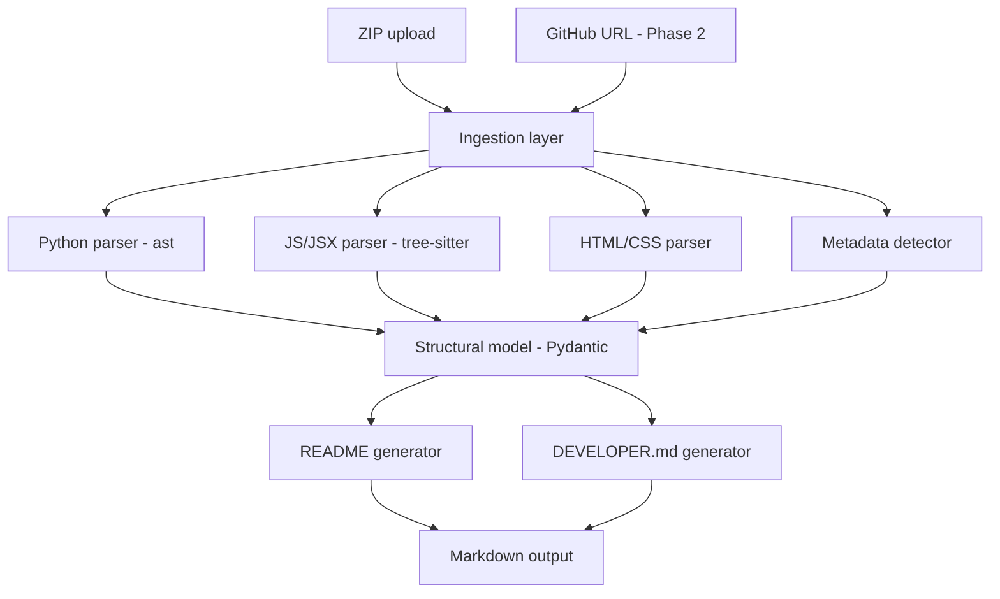

# CodeAtlas — Detailed Implementation Plan
*(working title — swap for whatever you like; the tool analyzes codebases and generates docs with zero LLM calls)*

## 1. Overview

A web app that statically analyzes a codebase (Python + HTML/CSS/JS/React) from a ZIP or GitHub repo and generates two documents — a README (overview, setup) and a DEVELOPER.md (architecture, file-by-file breakdown, code relationships) — using only parsing and rule-based heuristics. No AI/LLM calls, ever, at runtime.

**Context locked in:** portfolio project, Python/FastAPI backend, Python-analysis-first sequencing, ZIP-input-first (GitHub second).

## 2. Tech stack

| Layer | Choice | Notes |
|---|---|---|
| Backend framework | FastAPI | Async I/O for unzip/clone, Pydantic doubles as data model + API schema, free `/docs` |
| Python parsing | stdlib `ast` | Docstrings, signatures, classes, imports — zero dependencies |
| Python symbol resolution (later) | Jedi | Upgrade path for accurate cross-file call graphs (Phase 3+) |
| JS/JSX/HTML/CSS parsing | tree-sitter | One grammar engine covers all four; stays in Python, no Node subprocess |
| Tree-sitter packaging | `tree-sitter` core + `tree-sitter-python`/`tree-sitter-javascript`/`tree-sitter-html`/`tree-sitter-css`, or `tree-sitter-language-pack` as a bundle | The older `tree-sitter-languages` package is unmaintained — don't build on tutorials that reference it |
| HTML/CSS lightweight alt | BeautifulSoup4, tinycss2 | Use instead of tree-sitter for HTML/CSS if you want less setup |
| Data modeling | Pydantic v2 | Shared schema between internal logic and API responses |
| Templating | Jinja2 | Renders the structural model into README.md / DEVELOPER.md |
| Background jobs | FastAPI `BackgroundTasks` + in-memory dict (Phase 1–2) | Upgrade to Celery+Redis only if you actually hit scale limits |
| Diagrams in output | Mermaid | Renders natively in GitHub markdown, no image generation needed |
| Frontend (tool's own UI) | Plain HTML/CSS/JS (`fetch`) for Phase 1 → optional React/Vite upgrade in Phase 4 | Don't build React UI before the API is stable |
| Deployment | Single service (Render/Railway/Fly.io) serving FastAPI + static frontend | Avoids CORS and a second deployment target |

## 3. System architecture



The two documents are templates rendered off **one shared model** — not two separate analysis passes. Everything downstream depends on getting the model right first.

## 4. Repository structure

```
codeatlas/
├── backend/
│   ├── app/
│   │   ├── main.py                    # FastAPI app entrypoint
│   │   ├── api/
│   │   │   ├── routes_analyze.py      # POST /analyze/zip, /analyze/github
│   │   │   └── routes_jobs.py         # GET /jobs/{id}, /jobs/{id}/readme, /jobs/{id}/devdoc
│   │   ├── ingestion/
│   │   │   ├── zip_handler.py
│   │   │   └── github_handler.py      # Phase 2
│   │   ├── parsers/
│   │   │   ├── python_parser.py       # ast-based
│   │   │   ├── js_parser.py           # tree-sitter, Phase 3
│   │   │   ├── html_parser.py         # Phase 3
│   │   │   └── css_parser.py          # Phase 3
│   │   ├── models/
│   │   │   └── schema.py              # Pydantic models
│   │   ├── analysis/
│   │   │   ├── metadata_detector.py   # requirements.txt / pyproject.toml / package.json → framework detection
│   │   │   └── model_builder.py       # assembles ProjectModel from parsed files
│   │   ├── generators/
│   │   │   ├── readme_generator.py
│   │   │   └── devdoc_generator.py
│   │   └── core/
│   │       ├── config.py
│   │       └── workspace.py           # temp dir lifecycle management
│   ├── tests/
│   │   ├── fixtures/                  # small hand-crafted sample repos
│   │   └── test_python_parser.py ...
│   ├── requirements.txt
│   └── Dockerfile
├── frontend/
│   └── index.html                     # Phase 1: plain HTML/JS
├── docs/
│   └── CodeAtlas_Implementation_Plan.md
└── README.md
```

## 5. Data model (Phase 1 schema)

`backend/app/models/schema.py`:

```python
from pydantic import BaseModel
from typing import Optional

class ParamModel(BaseModel):
    name: str
    type_hint: Optional[str] = None
    default: Optional[str] = None

class FunctionModel(BaseModel):
    name: str
    docstring: Optional[str] = None
    params: list[ParamModel] = []
    return_type: Optional[str] = None
    decorators: list[str] = []
    is_async: bool = False
    line_number: int
    calls: list[str] = []          # naive name-match in Phase 1; Jedi-verified later

class ClassModel(BaseModel):
    name: str
    docstring: Optional[str] = None
    base_classes: list[str] = []
    methods: list[FunctionModel] = []
    line_number: int

class FileModel(BaseModel):
    path: str
    language: str                   # "python" | "javascript" | "html" | "css"
    module_docstring: Optional[str] = None
    imports: list[str] = []
    classes: list[ClassModel] = []
    functions: list[FunctionModel] = []
    loc: int

class DependencyInfo(BaseModel):
    name: str
    version: Optional[str] = None
    source: str                     # "requirements.txt" | "pyproject.toml" | "package.json"

class ProjectModel(BaseModel):
    name: str
    root_path: str
    detected_frameworks: list[str] = []
    dependencies: list[DependencyInfo] = []
    entry_points: list[str] = []
    files: list[FileModel] = []
    import_graph: dict[str, list[str]] = {}
```

`ProjectModel` also doubles as a FastAPI response model later — no separate API schema needed.

## 6. API design

| Method | Endpoint | Description |
|---|---|---|
| POST | `/analyze/zip` | Multipart ZIP upload → returns `job_id` |
| POST | `/analyze/github` | Repo URL (Phase 2) → returns `job_id` |
| GET | `/jobs/{job_id}` | Poll status: `pending` / `running` / `done` / `error` |
| GET | `/jobs/{job_id}/readme` | Fetch generated README.md content |
| GET | `/jobs/{job_id}/devdoc` | Fetch generated DEVELOPER.md content |
| GET | `/jobs/{job_id}/download` | Zip of both docs |

## 7. Phase-by-phase plan

### Phase 1 — Core Python engine (the vertical slice)
**Goal:** upload a ZIP of a Python project → get back a README.md + DEVELOPER.md.

1.1 Scaffold FastAPI project, folder structure, health-check endpoint
1.2 ZIP ingestion: unzip into temp workspace, walk tree, skip `.git`/`__pycache__`/`venv`/`.venv`/`node_modules`/`dist`/`build`
1.3 Python parser: `ast.parse()` each `.py` file → module docstring, imports, classes (with methods), functions (params/return type/decorators)
1.4 Metadata detector: parse `requirements.txt` (line-based) and `pyproject.toml` (via stdlib `tomllib`, Python 3.11+); map known package names → framework labels
1.5 Model builder: assemble `ProjectModel`, resolve each file's imports against other files in the repo to build `import_graph`
1.6 README generator: Jinja2 template → title, description (from top-level docstring, else fallback), detected stack, folder tree, framework-aware setup/run instructions
1.7 DEVELOPER.md generator: architecture prose + Mermaid `graph TD` of the import graph, file-by-file catalog grouped by directory, class/function reference tables
1.8 Wire up the API endpoints from §6 for the ZIP path
1.9 Minimal frontend: upload form, poll job status, render markdown (e.g. `marked.js` from CDN), download buttons
1.10 Tests: 2–3 hand-crafted fixture repos (tiny Flask app, plain package) with manually verified expected output

**Exit criteria:** a real small-to-medium Python repo produces a genuinely readable README + DEVELOPER.md; malformed files degrade gracefully (no 500s).

### Phase 2 — GitHub input
2.1 `POST /analyze/github` accepting a repo URL
2.2 Public repos: shallow clone (`git clone --depth 1`) via subprocess/GitPython into a temp workspace, then reuse the Phase 1 pipeline unchanged
2.3 Guaranteed cleanup (try/finally) — you're handling other people's code, temp dirs must not linger
2.4 *Optional stretch:* private repos via PAT, token used per-request only, never persisted
2.5 Guardrails: repo size cap, clone timeout, reject non-GitHub URLs cleanly

**Exit criteria:** paste a public GitHub URL, same output quality as the ZIP path.

### Phase 3 — Frontend language support
3.1 Add tree-sitter + per-language grammar packages (see §2 packaging note)
3.2 JS/JSX parser: walk the tree for `function_declaration`/`class_declaration`/`import_statement`/`export_statement`; detect React components (function returning JSX, or `class extends React.Component`); detect hooks by `use[A-Z]` naming
3.3 HTML parser: DOM structure, linked `<script>`/`<link>` tags, form fields
3.4 CSS parser: selectors + which HTML classes/ids they target
3.5 Extend `ProjectModel`/`FileModel` with a `components: list[ComponentModel]` field for React trees
3.6 Extend metadata detector: `package.json` → React/Vue/Next detection + npm/yarn script extraction
3.7 Extend both generators with frontend sections (component tree, HTML structure summary)

**Exit criteria:** a small React + Flask-API monorepo produces one unified doc pair covering both halves.

### Phase 4 — Polish & deployment (portfolio-critical)
4.1 UI upgrade to React/Vite if you want the visual polish (optional)
4.2 Deploy backend (Dockerfile from Phase 1 makes Render/Railway/Fly.io close to drop-in)
4.3 CI: GitHub Actions running pytest on push
4.4 Run CodeAtlas on its own repo — this is your strongest demo artifact
4.5 Screenshots/GIF for the portfolio writeup
4.6 Edge-case hardening: file-count/size caps with friendly errors, skip binaries gracefully, catch per-file `SyntaxError` instead of crashing the whole run

## 8. Testing strategy

- **Unit:** one test file per parser, asserting exact extracted structure against small hand-crafted fixtures
- **Integration:** a couple of real small open-source repos as fixtures; assert on structural facts ("detected FastAPI", "import graph has N edges") rather than exact strings, since generated prose can shift
- **Golden-file:** store expected README output for a fixture repo, diff in CI

## 9. Known hard problems

| Problem | Mitigation |
|---|---|
| File has no docstrings/comments | Fall back to structural description ("defines 3 functions, imports X/Y/Z") — never invent intent |
| Call graph noise on large repos | Depth cap or per-module scoping, not whole-repo by default |
| Cross-language relationships (Flask route serving a React build) | Nice stretch goal for Phase 3+, not required for MVP |
| Large repos are slow to parse synchronously | `BackgroundTasks` covers Phase 1–2; revisit with a real queue only if you hit that wall |

## 10. Suggested pacing (milestone-based, no fixed deadline)

1. **Milestone 1:** Phase 1 fully working, tested, and honestly already demo-worthy on its own
2. **Milestone 2:** Phase 2
3. **Milestone 3:** Phase 3
4. **Milestone 4:** Phase 4

One branch per phase, merge to `main` once that phase's exit criteria pass.

## 11. Portfolio notes

- A **live deployed demo** matters more than a polished README — get Phase 1 hosted early, even if ugly
- Running the tool **on its own repo** is a concrete, verifiable story for interviews ("here's the doc it wrote about itself")
- Test coverage + a CI badge signal engineering maturity beyond "it works on my machine"
- A short demo GIF embedded at the top of your own README goes further than paragraphs of description

## 12. Immediate next steps

```bash
mkdir codeatlas && cd codeatlas
mkdir -p backend/app/{api,ingestion,parsers,models,analysis,generators,core} backend/tests/fixtures frontend
cd backend
python -m venv venv
source venv/bin/activate          # .\venv\Scripts\activate on Windows
pip install fastapi "uvicorn[standard]" pydantic python-multipart jinja2
pip freeze > requirements.txt
```

`python-multipart` is easy to forget — FastAPI needs it for file-upload handling and fails at runtime without it.
